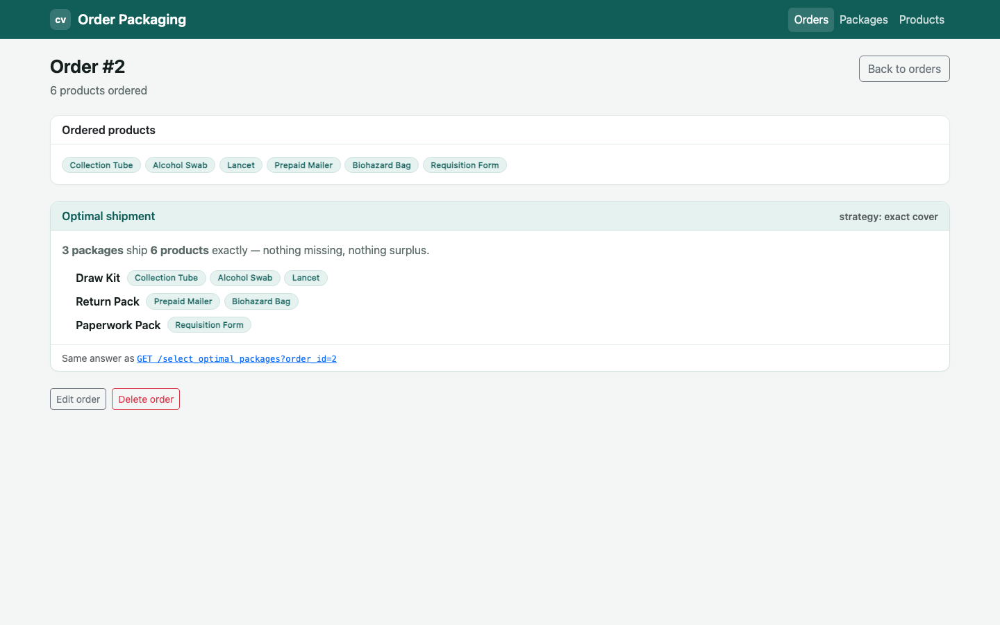
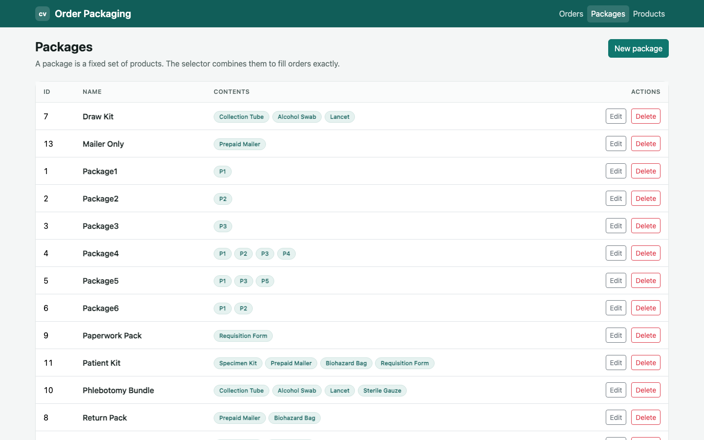
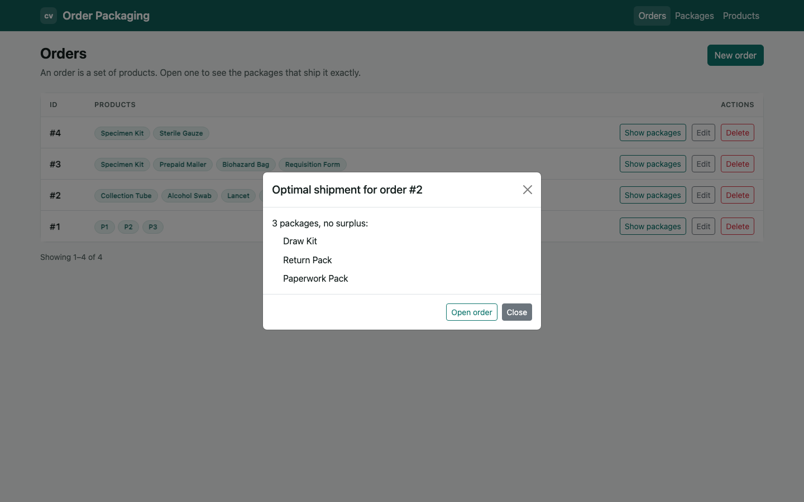
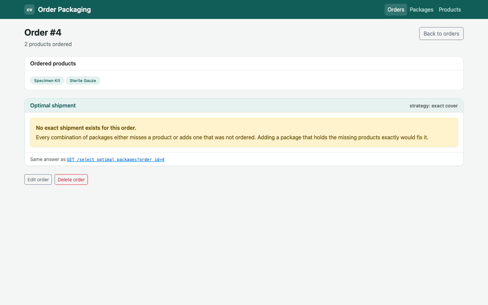
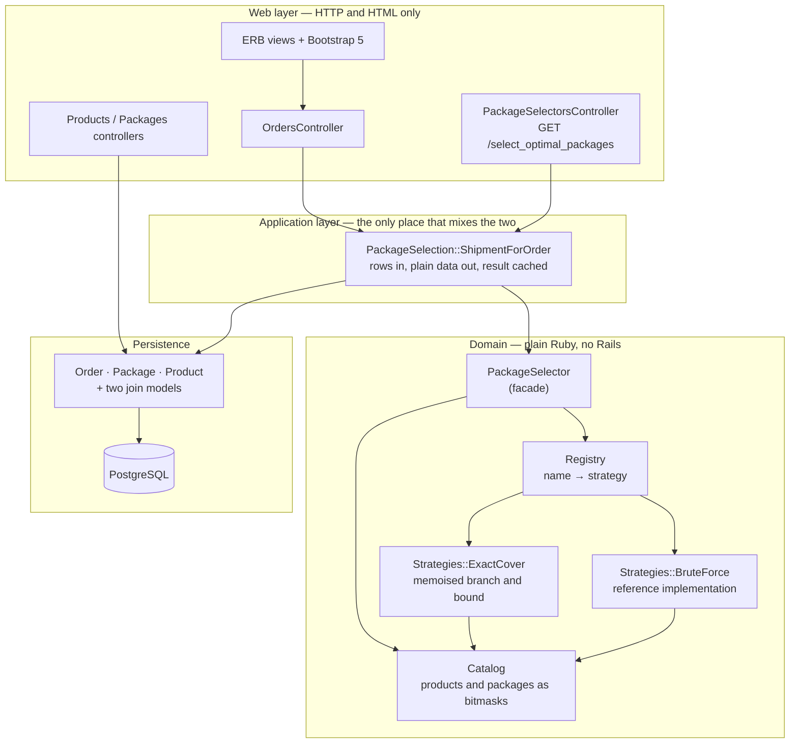
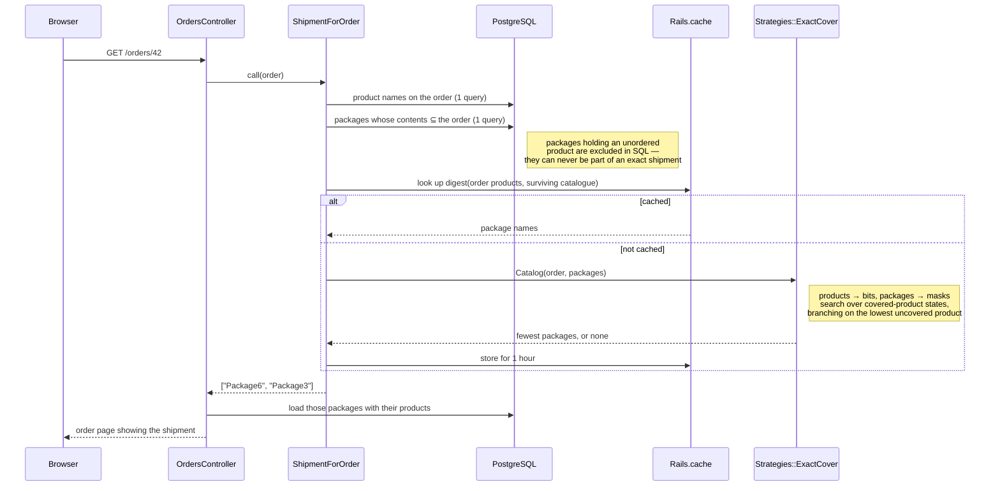

# Order Packaging

A Rails app for one question: given an **order** (a set of products) and a catalogue of
**packages** (each package holds a fixed set of products), what is the **smallest set of
packages that ships exactly the ordered products** — every ordered product covered, and
nothing surplus in the box?

That is a minimum-cardinality *exact cover*, and it is the whole point of the project. Around
it sits a small CRUD UI for products, packages and orders, plus a JSON endpoint that returns
the optimal shipment for an order.

Worked example, using the seed data:

| Package  | Contents       |
| -------- | -------------- |
| Package1 | P1             |
| Package2 | P2             |
| Package3 | P3             |
| Package4 | P1, P2, P3, P4 |
| Package5 | P1, P3, P5     |
| Package6 | P1, P2         |

For an order of `P1, P2, P3` the answer is **Package6 + Package3** (two packages), not
`Package1 + Package2 + Package3` (three). `Package4` covers the order but is rejected: it
would also ship `P4`.

## Screenshots

| The order page — the computed shipment | The package catalogue |
| --- | --- |
|  |  |

| Orders list, with the shipment modal | An order with no exact shipment |
| --- | --- |
|  |  |

## Architecture

Layered, with dependencies pointing inward: the selection algorithm knows nothing about
Rails, ActiveRecord or HTTP, and one adapter (`ShipmentForOrder`) is allowed to know about
all three.



## How a shipment is worked out



## Quickstart

### Docker (nothing else installed)

```shell
docker compose up --build
```

Then open <http://localhost:8180>. Compose starts PostgreSQL, waits for it, creates and
migrates the database, seeds it, and boots Puma. The seed data includes the worked example
above plus a small clinical-supplies catalogue with four orders — one of which deliberately
has no exact shipment.

```shell
docker compose run --rm test     # the spec suite, inside the same image
docker compose down -v           # stop, and drop the database volume
```

Host ports: **8180** for the app, **8181** for PostgreSQL.

### Local

Requires Ruby 3.0.x, PostgreSQL and Yarn.

```shell
bundle install
yarn install
cp .env.example .env             # then edit DB_USERNAME / DB_PASSWORD
bin/rails db:setup               # create, load schema, seed
bin/rails server
```

## Configuration

Every variable the app reads. All are optional; the defaults are what `bin/rails server`
uses on a developer machine.

| Variable                       | Required | Default                              | What it does |
| ------------------------------ | -------- | ------------------------------------ | ------------ |
| `DB_HOST`                      | no       | _(empty — local Unix socket)_        | PostgreSQL host. Compose sets it to `db`. |
| `DB_PORT`                      | no       | `5432`                               | PostgreSQL port. |
| `DB_USERNAME`                  | no       | `postgres`                           | Role used to connect. |
| `DB_PASSWORD`                  | no       | _(none)_                             | Password for that role. |
| `DB_NAME`                      | no       | `careviso_take_home_development`     | Database name (per environment). |
| `TEST_DB_NAME`                 | no       | `careviso_take_home_test`            | Database used by `rspec`. |
| `RAILS_MAX_THREADS`            | no       | `5`                                  | Puma threads and ActiveRecord pool size. |
| `PACKAGE_SELECTION_STRATEGY`   | no       | `exact_cover`                        | Which registered strategy answers by default (`exact_cover` or `brute_force`). |
| `PACKAGE_SELECTION_MAX_STATES` | no       | `200000`                             | Sub-problems the exact-cover search may visit before giving up with a 422. |
| `SECRET_KEY_BASE`              | in prod  | _(none)_                             | Rails session/verifier key. Compose supplies a development placeholder. |
| `RAILS_SERVE_STATIC_FILES`     | no       | unset (set in the image)             | Serve compiled assets from Puma instead of a proxy. |
| `RAILS_LOG_TO_STDOUT`          | no       | set in the image                     | Log to stdout instead of `log/production.log`. |
| `SKIP_DB_SETUP`                | no       | `false`                              | Skip migrate+seed in the container entrypoint. |

## Development

```shell
bundle exec rspec                        # the whole suite
bin/lint                                 # rubocop + rubocop-rails (installed on demand)
bundle exec rake package_selection:benchmark   # timings across catalogue sizes
bundle exec rake package_selection:states      # states visited as orders grow
bundle exec rake package_selection:hard        # the adversarial case
bin/webpack-dev-server                   # live reload for app/javascript
```

The test database is built from `db/schema.rb`; `bin/rails db:test:prepare` refreshes it.
Do **not** run `db:seed` against the test database — some specs create packages with the
same names as the seed data.

## Project structure

```
app/
  controllers/
    application_controller.rb          # 400 for missing params, 404 page for missing records
    concerns/paginatable.rb            # LIMIT/OFFSET for the index pages
    orders_controller.rb               # CRUD + the server-rendered shipment on #show
    packages_controller.rb
    products_controller.rb
    package_selectors_controller.rb    # GET /select_optimal_packages (JSON)
    health_controller.rb               # GET /health, used by the container healthcheck
  models/                              # Order · Package · Product + two join models
  services/
    package_selector.rb                # facade: order + packages -> package names
    package_selection.rb               # namespace and its error classes
    package_selection/
      catalog.rb                       # normalisation, filtering, bitmasks
      candidate.rb                     # one package as (name, mask, product_count)
      registry.rb                      # the strategy seam
      shipment_for_order.rb            # ActiveRecord adapter + caching
      strategies/
        base.rb                        # the contract
        exact_cover.rb                 # the algorithm that ships
        brute_force.rb                 # the obvious algorithm, kept as an oracle
  views/
    shared/                            # page header, pagination, badges, empty states
    orders/ packages/ products/
  javascript/packs/application.js      # Select2 multi-selects, the shipment modal
lib/
  catalog_builder.rb                   # randomised catalogues for specs and benchmarks
  tasks/package_selection.rake         # benchmark / states / hard
spec/
  services/package_selection/          # catalog, registry, both strategies, the adapter
  requests/                            # rendered pages, error handling, health
  controllers/ models/ factories/
```

`test/` is the empty Minitest scaffolding from `rails new`; RSpec is the test framework here.

## Design notes

### The algorithm is the exercise

The first implementation enumerated subsets of the **catalogue**: recursive backtracking over
package index positions, no memoisation, `Array#include?` and `Array#-` on every node. That
is Θ(2^P) for P packages, and it re-solved identical sub-problems constantly — two different
sets of packages that cover the same products leave behind exactly the same remaining problem.

The version that ships flips the state space. What matters is not *which packages have been
picked* but *which products are already covered*, so the search runs over covered-product
bitmasks:

1. **Filter first.** A package holding a product the order did not ask for can never appear in
   an exact shipment. `Catalog` drops those, drops empty packages, and de-duplicates packages
   with identical contents. This is also pushed into SQL, so those rows never leave PostgreSQL.
2. **Bitmask everything.** Products become bits, packages become integers. "Does this package
   fit alongside what I have already picked?" is one `AND`.
3. **Branch on the lowest uncovered product.** Every exact cover must cover it somehow, so
   trying only the packages that contain it loses no solutions — and collapses the branching
   factor from "every package" to "packages holding this one product". This is the simplifying
   idea behind Knuth's Algorithm X.
4. **Memoise by covered-mask**, so each distinct sub-problem is solved once.
5. **Prune with a counting bound.** k remaining products need at least ⌈k / largest package⌉
   packages; when the best solution so far reaches that bound it is provably optimal and the
   branch stops.

Complexity: **O(2ⁿ · P) time and O(2ⁿ) memo entries in the worst case**, where n is the number
of distinct products *on the order* and P the number of packages that survive filtering. The
old implementation was exponential in the size of the whole catalogue; this one is exponential
only in the size of the order, and in practice reaches a small fraction of those states because
only unions of disjoint packages are reachable.

Minimum exact cover is NP-hard, so there is no getting rid of the worst case — only bounding
it. `PACKAGE_SELECTION_MAX_STATES` caps the number of sub-problems a single request may visit;
past it the search raises and the endpoint answers `422` instead of holding a Puma thread.

### Edge cases, and what they do

| Case | Behaviour |
| --- | --- |
| No exact shipment exists | `nil` / `404` from the endpoint / an explanation on the order page. Surplus is never shipped to make an answer. |
| Several minimal shipments tie | One is chosen deterministically — candidates are sorted largest-first, ties broken by name, so the same input always gives the same answer. |
| A product appears in no package | Detected before the search starts (`Catalog#coverable?`), returns `nil` immediately. |
| The same product listed twice on an order | Collapsed to one; the database also has a unique index preventing it. |
| Two packages with identical contents | Interchangeable, so only one is kept and named. |
| An order too large to solve synchronously | `SearchLimitExceeded` → `422` with a clear message, rather than a hung request. |

### What the numbers actually are

`bundle exec rake package_selection:benchmark`, on an M-series laptop inside the Docker image:

```
case                     order  packages       kept   packages  exact cover  brute force
------------------------------------------------------------------------------------------
the brief's example          3         7          4          1       0.0 ms       0.1 ms
a small warehouse            8        42         23          2       0.1 ms          n/a
a real catalogue            12       203         75          3       0.1 ms          n/a
a big catalogue             16      1004        262          4       0.3 ms          n/a
a very big catalogue        20      5005        811          5       1.1 ms          n/a
a silly catalogue           24     20006       1930          6       3.0 ms          n/a

kept = packages that survive filtering; "packages" is the size of the answer.
brute force is only run when 2^kept is finishable; n/a means it is not.
```

The exhaustive search cannot finish past about 20 surviving packages — it is kept as a
reference implementation and as a test oracle, not as something to run.

Growth with the size of the *order* rather than the catalogue
(`rake package_selection:states`). On catalogues that look like real ones the counting bound
is tight, so the search visits one state per package in the answer — it never backtracks:

```
  order  packages       kept states visited         time
----------------------------------------------------------
      4       501         15              1       0.2 ms
      8       502         84              2       0.1 ms
     12       503        135              3       0.2 ms
     16       504        160              4       1.6 ms
     20       505        167              5       0.3 ms
     24       506        184              6       0.7 ms
     28       507        179              7       0.8 ms
```

And the honest worst case (`rake package_selection:hard`) — every package holds exactly two
products, so an exact shipment is a perfect matching, and with an odd number of products
there is none and the search has to prove it:

```
  order  packages  states visited         time
-----------------------------------------------
      7        21              21       0.1 ms
      9        36              55       0.1 ms
     11        55             144       0.4 ms
     13        78             377       1.1 ms
     15       105             987       3.5 ms
     17       136            2584      10.6 ms
     19       171            6765      28.2 ms
     21       210           17711     100.0 ms
```

Exponential, as it must be — but at roughly φⁿ rather than 2ⁿ, and bounded by the work budget.
This is the case the budget exists for.

### Correctness: two implementations, one contract

`Strategies::BruteForce` is the obvious reading of the brief — try every subset, smallest
first — and is correct by construction. It is registered as a real strategy and the spec suite
runs both implementations against **400 randomised catalogues**, asserting they always agree on
whether a shipment exists and on how many packages it takes, and that every shipment returned
is genuinely exact. A fast algorithm nobody can check is not an improvement.

### Layering

- **Domain** (`PackageSelection::*`, `PackageSelector`) is plain Ruby: no ActiveRecord, no
  Rails, no clock. It can be exercised from a spec, a rake task or a script with literal data.
- **Application** is one object, `ShipmentForOrder`: it turns rows into plain arrays, calls the
  domain, and caches the answer. It is the only place the two worlds meet.
- **Web** controllers are thin — find a record, call one object, render. `Product.all` was
  moved out of the order and package forms into the controllers.

### Scalability, honestly

The bottleneck here is algorithmic, not operational; this is a CRUD app in front of a hard
combinatorial problem. What was actually wrong, and what was done:

- **The search itself** — see above. From exponential in the catalogue to exponential in the
  order, plus filtering that removes most of the catalogue before the search begins.
- **An N+1 on every selection request.** `Package.all.map { |p| p.products.pluck(:name) }` ran
  one query per package. It is now a single join query, further narrowed by a `NOT IN` that
  excludes packages containing any unordered product — so a 50,000-package catalogue sends a
  handful of rows to Ruby for a three-product order.
- **N+1s on the index pages.** `orders#index` and `packages#index` now use `includes`.
- **Unbounded index queries.** All three index pages now paginate (`Paginatable`, ~40 lines;
  a pagination gem would have to earn its place in a take-home).
- **Repeated identical searches.** The result is cached under a digest of the exact inputs —
  the ordered products and the surviving catalogue — so re-opening an order is free, any edit
  to either side produces a different key rather than a stale answer, and two orders for the
  same products share one entry.
- **Missing constraints.** The join tables had no uniqueness, so a product could be attached
  to the same order twice — which would make "ship each product exactly once" ambiguous. There
  are now composite unique indexes (which also subsume the old single-column ones) and
  matching model validations.

### Extensibility

The seam is `PackageSelection::Registry`. "Fewest packages" is one reading of a shipping
problem; a warehouse quickly wants "cheapest", "fewest touches", "prefer this warehouse's
stock", or a heuristic that trades optimality for a hard latency bound. Those are the same
input and the same output with different logic in the middle — a strategy, not a flag.

```ruby
class CheapestShipment < PackageSelection::Strategies::Base
  def call
    # catalog.candidates, catalog.full_mask, catalog.candidates_by_bit
  end
end

PackageSelection::Registry.register(:cheapest, CheapestShipment)
```

Nothing else changes: `PACKAGE_SELECTION_STRATEGY=cheapest` or
`ShipmentForOrder.call(order, strategy: :cheapest)` picks it up, and the shared spec
`"a package selection strategy"` is the contract it has to satisfy. The registry is not
speculative — it already holds two implementations that the suite cross-checks.

## The JSON endpoint

```
GET /select_optimal_packages?order_id=<id>
```

`200 OK`

```json
{ "shipment_packages": ["Package6", "Package3"] }
```

`404 Not Found` — the order does not exist:

```json
{ "error": "Order not found" }
```

`404 Not Found` — no combination ships the order exactly:

```json
{ "error": "No valid packages found" }
```

`422 Unprocessable Entity` — the search hit its work budget:

```json
{ "error": "Order is too large to package synchronously" }
```

## Domain model

```
Product ──< OrderProduct >── Order
   └──────< PackageProduct >── Package
```

- `Product` — a unique name.
- `Package` — a unique name plus the products it always contains.
- `Order` — no attributes of its own; a set of products, invalid when empty.
- `OrderProduct` / `PackageProduct` — join tables with foreign keys and composite unique
  indexes. Deleting an order, package or product removes its join rows and leaves the other
  side intact.

## Limitations

- **No authentication or authorisation.** Every route is public.
- **The selection is recomputed, not stored.** Packages and orders are both editable, so an
  order does not snapshot the shipment it was quoted. A real system would persist the chosen
  shipment at fulfilment time.
- **The cache is per-process.** `:memory_store` in production means each Puma worker keeps its
  own copy; a multi-process deployment wants Memcached or Redis.
- **Large orders are refused, not queued.** Past `PACKAGE_SELECTION_MAX_STATES` the request
  gets a 422. The right answer at that size is a background job writing the result back to the
  order, which is beyond the scope of the exercise.
- **Quantities are not modelled.** An order is a *set* of products: two of the same product
  cannot be ordered, and packages hold one of each. The brief is stated that way, and the
  bitmask representation assumes it.
- **No package cost or weight**, so "smallest set" is a count of packages and nothing else.
- **Ruby 3.0 is end of life.** The version is pinned by the original exercise; the Docker image
  uses 3.0.2 because no official 3.0.1 image exists on a Debian release that still has package
  archives.
